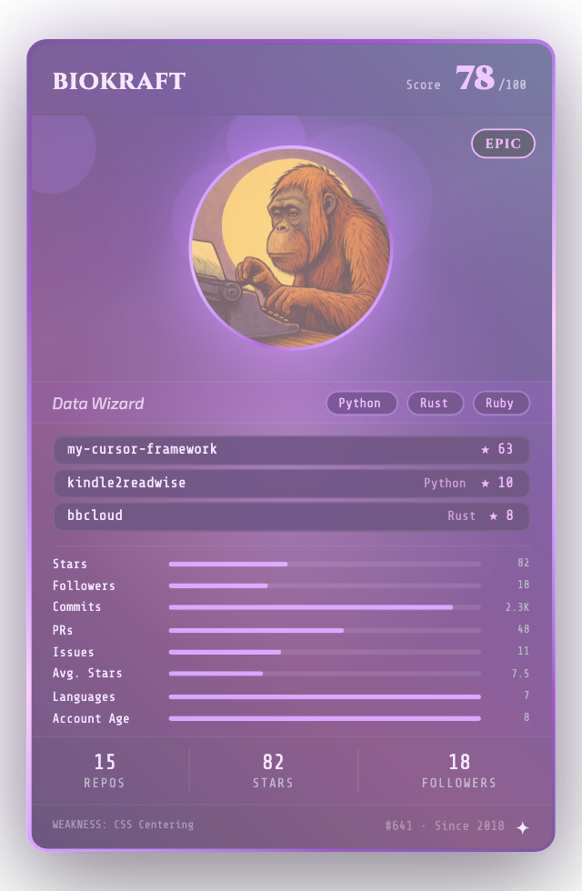

  &nbsp;&nbsp;&nbsp;&nbsp;&nbsp;&nbsp;&nbsp;&nbsp;&nbsp;&nbsp;&nbsp;&nbsp;
   &nbsp;&nbsp;&nbsp;&nbsp;&nbsp;&nbsp;&nbsp;&nbsp;&nbsp;&nbsp;&nbsp;&nbsp;<i>(not centered on purpose — see card weakness ↓)</i>

<h3 align="center">Hey, I'm Seán 👋</h3>

<i>Monkey with an AI-assisted typewriter.</i>

---

### What I do

AI Engineer @ CHECK24, based in Munich. I spend my days building agentic systems and my nights writing about what happens when you let AI loose on real problems — for better or worse.

### What I write about

Over on [Medium](https://biokraft.medium.com), I dig into:

- **Living with AI coding agents day to day** — what actually changes when Claude is doing half your keystrokes, IDE-optional workflows, subagent loops
- **Spec-driven & vibe-driven development** — how AI is reshaping the way software actually gets built
- **Applied AI experiments** — pointing LLMs at unglamorous personal problems and seeing what breaks

Some recent pieces:
- [I Got Claude on My Wrist, Diamonds on My Neck](https://biokraft.medium.com/i-got-claude-on-my-wrist-diamonds-on-my-neck-6b14af59f7cb)
- [I Shipped My First Open Source Repo, and Skipped the MCP Server](https://medium.com/technology-hits/i-shipped-my-first-open-source-repo-and-skipped-the-mcp-server-808ae54305e6)
- [I Deleted My IDE](https://biokraft.medium.com/i-deleted-my-ide-d91d79812033)
- [The Subagent Loop I Didn't Know I Needed](https://medium.com/illumination/the-subagent-loop-i-didnt-know-i-needed-6adcd621d331)
- [How I Actually Code with AI in 2026 (And Stopped Wasting Tokens)](https://medium.com/technology-hits/how-i-actually-code-with-ai-in-2026-and-stopped-wasting-tokens-99b2fd550abb)

### On GitHub

Building small, sharp tools rather than big frameworks — think `bbcloud`, `kindle2readwise`, and whatever weird cursor/terminal experiment is currently living rent-free in my head.

  Card generated with <a href="https://github.com/dougmaitelli/gitcg">GiTCG</a> — score updates as the repos do.

